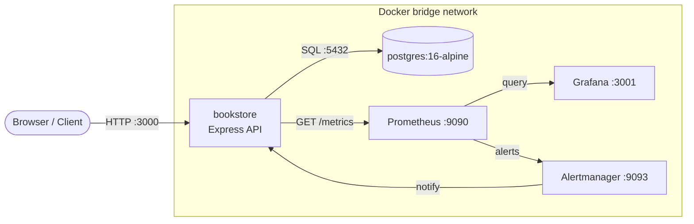
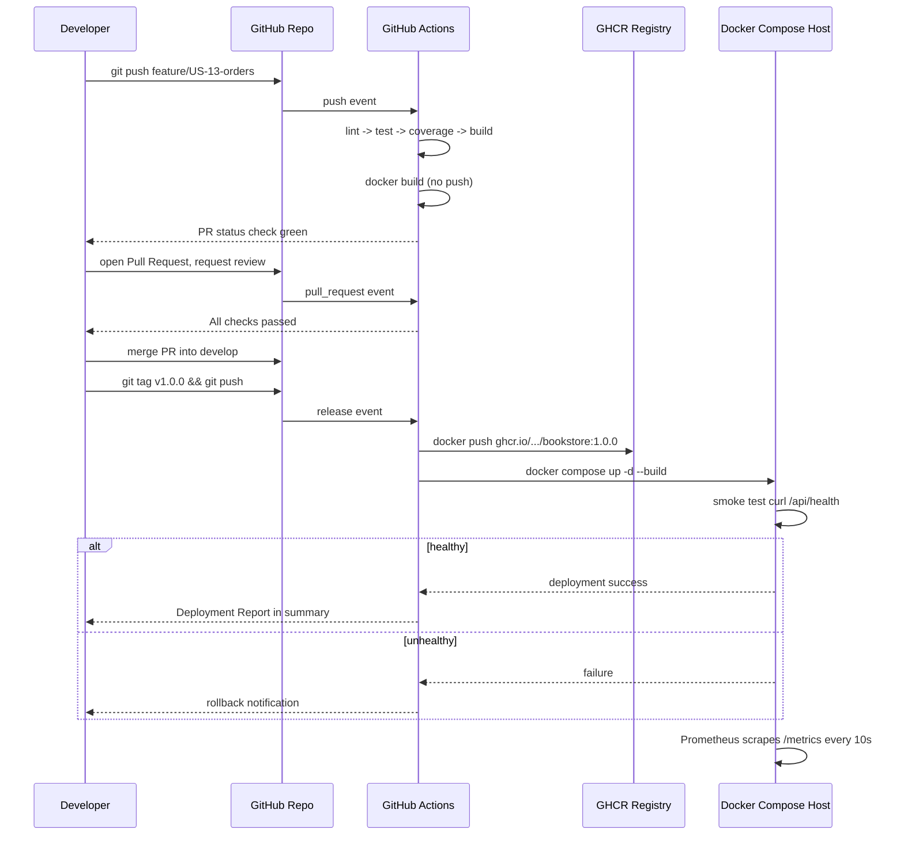

# Architecture Diagram - End-to-End DevOps Pipeline

## 1. Full Pipeline Flow (Code -> Production -> Monitoring)

```mermaid
flowchart TB
    subgraph PLAN["1. AGILE PLANNING"]
        A1[Product Backlog<br/>USER_STORIES.md]
        A2[Sprint Planning<br/>SPRINT_BACKLOG.md]
        A3[Sprint Review<br/>Retrospective]
        A1 --> A2 --> A3
    end

    subgraph VCS["2. GIT VERSION CONTROL"]
        B1[main<br/>production]
        B2[develop<br/>integration]
        B3[feature/US-12-search<br/>US-13-orders]
        B4[Pull Request<br/>code review]
        B1 --- B2
        B2 --- B3
        B3 -->|merge after review| B2
        B2 -->|release tag v1.0.0| B1
    end

    A3 -->|ready story| B3
    B3 --> B4
    B4 -->|approved + merged| B2

    subgraph CI["3. CONTINUOUS INTEGRATION - GitHub Actions"]
        C1{ci.yml triggered}
        C2[Checkout code]
        C3[Setup Node 20]
        C4[npm ci]
        C5[Lint]
        C6[Unit Tests + Coverage]
        C7[Build dist/build-info.json]
        C8{All steps pass?}
        C1 --> C2 --> C3 --> C4 --> C5 --> C6 --> C7 --> C8
        C8 -->|No| C9[Job fails - PR blocked]
        C8 -->|Yes| C10[Docker Buildx build image]
    end

    B4 --> C1

    subgraph REG["4. CONTAINER REGISTRY"]
        D1[(GHCR<br/>ghcr.io/umesh2904x/DevOpsASS2)]
    end

    C10 --> D1

    subgraph CD["5. CONTINUOUS DEPLOYMENT - cd.yml"]
        E1[Tag pushed v*]
        E2[Build and push image]
        E3[docker compose up -d]
        E4[Smoke test /api/health]
        E5{Healthy?}
        E1 --> E2 --> E3 --> E4 --> E5
        E5 -->|No| E6[Rollback + alert]
    end

    B2 -->|git tag v1.0.0| E1
    D1 --> E2

    subgraph RUNTIME["6. APPLICATION RUNTIME - Docker Compose"]
        F1[bookstore<br/>node:20-alpine :3000]
        F2[(postgres:16<br/>bookstore-db)]
        F3[/metrics endpoint]
        F1 --- F2
        F1 --> F3
    end

    E5 -->|Yes| F1

    subgraph MON["7. MONITORING"]
        G1[Prometheus<br/>:9090 scrapes /metrics]
        G2[Grafana<br/>:3001 dashboards]
        G3[Alertmanager<br/>:9093]
        G4[bookstore-up / alert rules]
        G3 --> G4
    end

    F3 -->|scrape every 10s| G1
    G1 --> G2
    G1 -->|firing alert| G3
    G2 -->|engineer sees dashboard| G4
    G4 -->|new bug| A1

    style PLAN fill:#e8f4ea
    style VCS fill:#e3e8f4
    style CI fill:#fdf0e3
    style REG fill:#f0e3f4
    style CD fill:#fde8e8
    style RUNTIME fill:#e8f4f4
    style MON fill:#f4f0e3
```

## 2. Docker Compose Service Topology



## 3. CI/CD Pipeline Stages (visual summary)



## 4. Q1 Architecture (CI/CD Pipeline)

```mermaid
flowchart LR
    A[Git push / PR] --> B[ci.yml]
    B --> C[Lint]
    C --> D[Tests + Coverage]
    D --> E[Build artifact]
    E --> F[Docker Buildx image build]
    F --> G[(GHCR)]
    G --> H[git tag v1.0.0]
    H --> I[cd.yml]
    I --> J[docker compose up]
    J --> K[Smoke test]
    K --> L[Live service :3000]
    L --> M[Prometheus]
    M --> N[Grafana]
```



## 5. Q2 Architecture (MLOps with MLflow)

```mermaid
flowchart TB
    subgraph DEV["Model Development"]
        T[train.py<br/>6 candidate models]
        T --> E1[(MLflow Tracking Server<br/>runs, params, metrics)]
        T --> REG[(Model Registry<br/>cancer-detector)]
        T --> REG
    end

    subgraph SERVE["Model Serving"]
        API[serve_model.py<br/>Flask REST API :8000]
        API -->|models:/cancer-detector@champion| REG
        API --> M[/metrics]
    end

    subgraph OBS["Monitoring"]
        LT[load_test.py<br/>traffic generator]
        PM[Prometheus :9090]
        GFX[Grafana :3001]
        LT --> API
        M -->|scrape 10s| PM
        PM --> GFX
    end

    E1 -->|view runs| UI[MLflow UI :5000]
    REG -->|version + alias| API

    style DEV fill:#e8f4ea
    style SERVE fill:#fdf0e3
    style OBS fill:#f4f0e3
```
